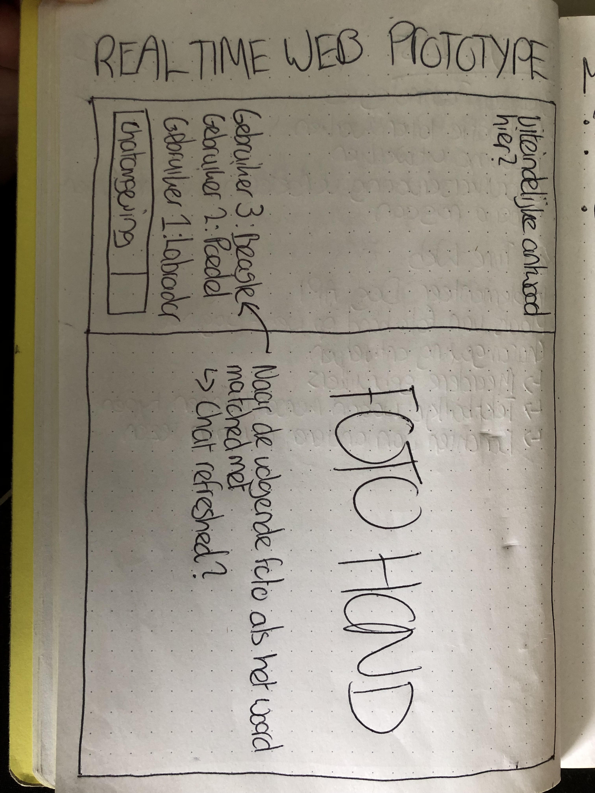

# Real Time Web ReadMe

## Link naar eindproduct
https://real-time-web-2223-production-4795.up.railway.app/

## Intro
Het vak Real Time Web wordt gegeven door Justus en Shyanta. In dit vak ga ik leren hoe ik een real time web applicatie maak. Dit houdt in dat ik technieken ga leren hoe ik een open connectie opzet tussen de client en de server. Hierdoor kan ik real-time data versturen in beide richtingen, op hetzelfde moment.

### Wat ik ga leren
- Omgaan met real-time complexiteit;
- Omgaan met real-time client-server interactie;
- Omgaan met real-time gegevensbeheer;
- Omgaan met ondersteuning voor meerdere gebruikers.
- Omgaan met sockets en socket.io
- Omgaan met node js en express js

## Mijn concept
Mijn concept is een spel waarin je moet raden welke hondsoort een bepaalde hond is gebaseerd op een plaatje op de webpagina. De gebruiker kan, met meerdere mensen, raden welk hondsoort er op het plaatje wordt weergegeven. Zodra de gebruiker het antwoord juist heeft geraden, wordt dit in de chat weergegeven.

### Week 1
In de eerste week heb ik met klasgenoten gewerkt aan een chat applicatie, om op te warmen en te kijken hoe sockets werken. Verder ben ik ga nadenken over mijn concept voor de eindopdracht.

### Week 2

## De data-lifecycle

## Real time events

## External data
De api die ik gebruikt heb voor mijn opdracht is de Dog API. Met deze API kan je plaatjes en hondsoort-namen ophalen. De hondsoorten kan je uit een URL krijgen (zoals ik heb gedaan).
