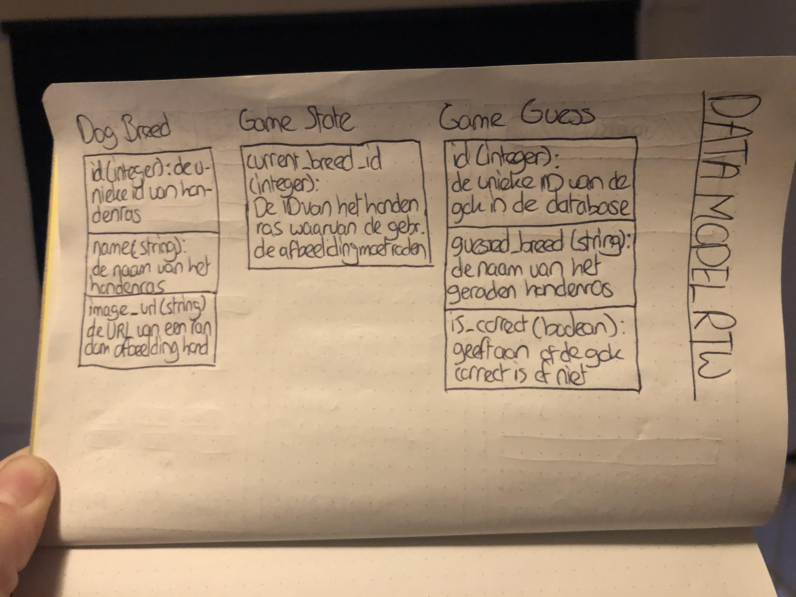
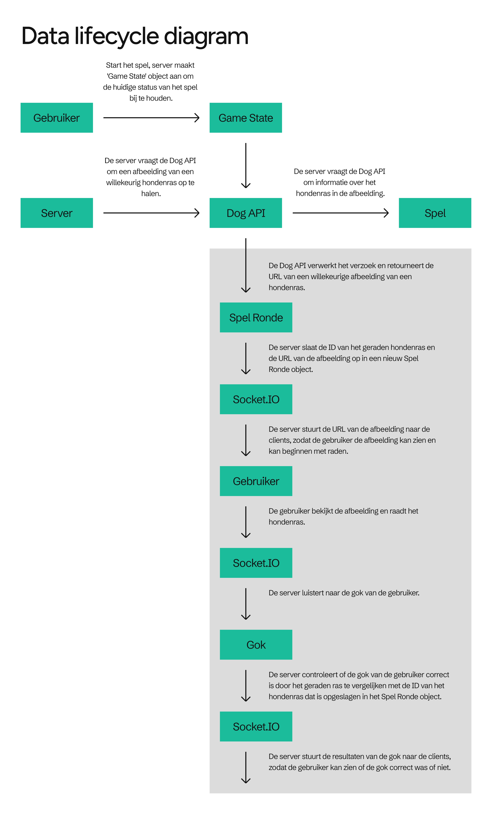

# Real Time Web ReadMe


(Geen poging om extra punten te scoren met een schattige hond)

## Link naar eindproduct/deployment
https://real-time-web-2223-production-4795.up.railway.app/

## Installatie
Gebruik de terminal om dit project te installeren en clonen.
```
git clone https://github.com/brentjeh/real-time-web-2223.git
```

Installeer de packages.
```
npm install
```

Start de server.
```
npm run start
```

## Intro
Het vak Real Time Web wordt gegeven door Justus en Shyanta. In dit vak ga ik leren hoe ik een real time web applicatie maak. Dit houdt in dat ik technieken ga leren hoe ik een open connectie opzet tussen de client en de server. Hierdoor kan ik real-time data versturen in beide richtingen, op hetzelfde moment.

### Wat ik ga leren
- Omgaan met real-time complexiteit;
- Omgaan met real-time client-server interactie;
- Omgaan met real-time gegevensbeheer;
- Omgaan met ondersteuning voor meerdere gebruikers.
- Omgaan met sockets en socket.io
- Omgaan met node js en express js

### Week 1
In de eerste week heb ik met klasgenoten gewerkt aan een chat applicatie, om op te warmen en te kijken hoe sockets werken. Verder ben ik ga nadenken over mijn concept voor de eindopdracht.

### Week 2
Deze week ga ik dieper in op client-server communicatie en datamanagement.
Als eerst ging ik een concept bedenken. Ik wist wel dat ik het mezelf niet al te moeilijk ging maken, aangezien ik in het vorige vak al best wat moeite met client-server communicatie had. Ik had hiervoor gelukkig een heel makkelijke API gevonden: De Dog API.

#### Mijn concept
Mijn concept is een spel waarin je moet raden welke hondsoort een bepaalde hond is gebaseerd op een plaatje op de webpagina. De gebruiker kan, met meerdere mensen, raden welk hondsoort er op het plaatje wordt weergegeven. Zodra de gebruiker het antwoord juist heeft geraden, wordt dit in de chat weergegeven.


## De code
De structuur van mijn app:

public/css/style.css
public/js/script.js
views/index.ejs
app.js
package-lock.json
package.json

### app.js
Het app.js bestand is de hoofdserver van mijn app. De server gebruikt socket.io, node.js en Express.

De server luistert naar een connectie.
```
io.on('connection', socket => {
```

De server roept de statische bestanden op.
```
app.use(express.static('public'))
app.use('/css', express.static(__dirname + 'public/css'))
app.use('/js', express.static(__dirname + 'public/js'))
app.use('/img', express.static(__dirname + 'public/img'))
```

Hier haalt de server een willekeurig plaatje van een hond en de naam van het rassensoort van de hond. Met 'breed' wordt de naam van het rassensoort van de hond uit de URL gehaald.
```
const randomDog = async () => {
  const url = `https://dog.ceo/api/breeds/image/random`
  const pokeData = await fetchData(url)
  data = pokeData
  console.log(data)
  breed = data.message.split('/')[4];
  return data
  return breed
}

async function fetchData(url){
  const apiData = await fetch(url)
      .then(response => response.json())
      .catch(err => console.log(err))
  return apiData
};
```

Dit stuk code verwerkt een nieuwe gebruiker die verbinding maakt met de socket.io-server. Vervolgens wordt er een bericht verstuurd naar alle andere clients (behalve de huidige socket) om hen op de hoogte te stellen van de nieuwe gebruiker. Dit gebeurt met behulp van het event 'user-connected' en de naam van de nieuwe gebruiker als argument. Daarna wordt er de functie 'randomDog()' opgeroepen om gegevens over een willekeurige hond te genereren. Zodra deze gegevens beschikbaar zijn, worden ze naar alle clients gestuurd met behulp van het event 'render-dog'. Dit stelt alle clients in staat om de gegevens te gebruiken en de hond op hun eigen interface weer te geven.
```
socket.on('new-user', name => {
        users[socket.id] = name
        socket.broadcast.emit('user-connected', name)
        randomDog()
        // console.log(breed)

        .then(data => {
            io.emit('render-dog', data)
        })
    })
```

Dit stuk code verzend de chatgeschiedenis.
```
socket.emit('history', history)
```

Deze code voegt het ontvangen bericht toe aan de geschiedenis, stuurt het chatbericht naar alle andere clients, inclusief de naam van de afzender en controleert of het ontvangen bericht gelijk is aan de rassensoort van de hond en geeft daarbij een bijbehorende 'correct' message.
```
socket.on('send-chat-message', message => {
        while (history.length > historySize) {
          history.shift()
        }
        history.push(message);
        console.log(history)

        socket.broadcast.emit('chat-message', { message: message, name: users[socket.id] })

        if (message  ==  breed) {
            io.emit('correct', { data: data, name: users[socket.id] })
        }
    })
```

Deze code zorgt voor wanneer een user disconnect.
```
socket.on('disconnect', () => {
        socket.broadcast.emit('user-disconnected', users[socket.id])
        delete users[socket.id]
    })
```

### script.js
```
socket.on('chat-message', data => {
  appendMessage(`${data.name}: ${data.message}`)
})
```

#### Data model
Omdat ik een klein idee wil hebben over welke data ik nodig heb om dit spel te maken, heb ik een data model gemaakt. Hierin heb ik de eigenschappen van de Dog API gezet.



## De data-lifecycle



## External data
De api die ik gebruikt heb voor mijn opdracht is de Dog API. Met deze API kan je plaatjes en hondsoort-namen ophalen. De hondsoorten kan je uit een URL krijgen (zoals ik heb gedaan). De Dog API is een RESTful API waarmee ontwikkelaars toegang hebben tot een uitgebreide database met informatie over honden, zoals rassen, afbeeldingen en feiten. Hier zijn enkele belangrijke eigenschappen van de Dog API:
- Rate Limiting: De Dog API heeft rate limiting ingesteld om misbruik te voorkomen en ervoor te zorgen dat de service presteert voor alle gebruikers. De huidige rate limit is       ingesteld op 1000 verzoeken per uur.
- Autorisatiemethode: Om de Dog API te gebruiken, moet je een API-sleutel verkrijgen van de API-provider. De API-sleutel wordt gebruikt om je verzoeken te authenticeren en ervoor   te zorgen dat je toestemming hebt om toegang te krijgen tot de API.
- API-methoden: De Dog API biedt verschillende API-methoden die ontwikkelaars kunnen gebruiken om informatie over honden op te halen. Deze omvatten: 
  Rassenlijst: Haalt een lijst op van alle hondenrassen die door de API worden erkend.
  Willekeurige afbeelding: Haalt een willekeurige afbeelding van een hond op.
  Rasafbeeldingen: Haalt een lijst met afbeeldingen op voor een specifiek hondenras.
  Raszoeken: Zoekt naar een specifiek hondenras op naam.
  Feiten: Haalt een willekeurig hondenfeit op.
